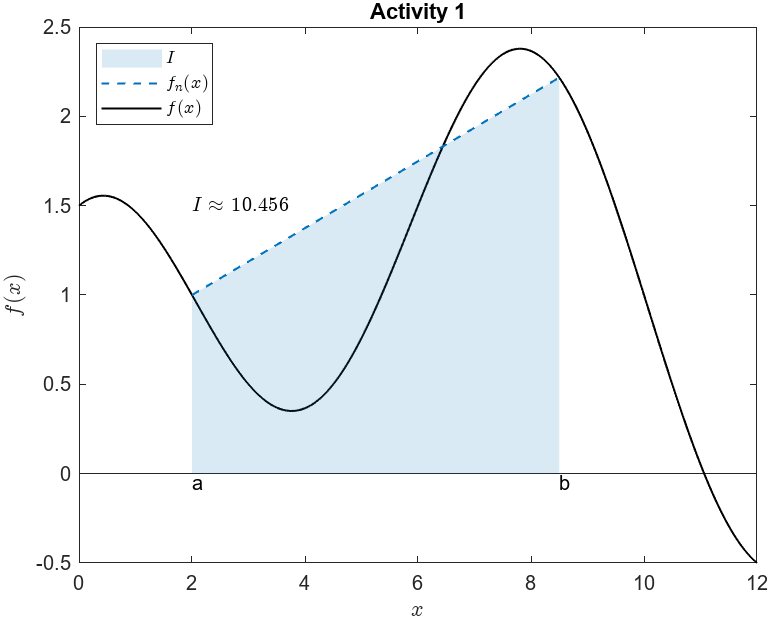
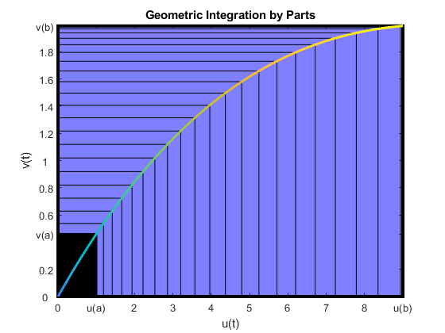

# Numerical Integration

 or 

**Curriculum Module**

_Created with R2020b. Compatible with R2020b and later releases._

# Information

This curriculum module contains interactive [MATLAB® live scripts](https://www.mathworks.com/products/matlab/live-editor.html) that teach two fundamental techniques for approximating definite integrals: the trapezoid and Simpson’s rules. These rules are derived from Lagrange interpolating polynomials and explored through interactive visualizations.

## Background

You can use these live scripts as demonstrations in lectures, class activities, or interactive assignments outside class. This module covers the derivation and implementation of the trapezoid rule and the 1/3 and 3/8 Simpson's rules. 

The instructions inside the live scripts will guide you through the exercises and activities. Get started with each live script by running it one section at a time. To stop running the script or a section midway (for example, when an animation is in progress), use the  Stop button in the **RUN** section of the **Live Editor** tab in the MATLAB Toolstrip.

## Contact Us

Solutions are available upon instructor request. Contact the [MathWorks teaching resources team](mailto:onlineteaching@mathworks.com) if you would like to request solutions, provide feedback, or if you have a question.

## Prerequisites

This module assumes knowledge of [MATLAB Onramp](https://matlabacademy.mathworks.com/details/matlab-onramp/gettingstarted) – a free two-hour introductory tutorial that teaches the essentials of MATLAB.

## Getting Started
### Accessing the Module
### **On MATLAB Online:**

Use the  link to download the module. You will be prompted to log in or create a MathWorks account. The project will be loaded, and you will see an app with several navigation options to get you started.

### **On Desktop:**

Download or clone this repository. Open MATLAB, navigate to the folder containing these scripts and double-click on [NumericalIntegration.prj](https://matlab.mathworks.com/open/github/v1?repo=MathWorks-Teaching-Resources/Numerical-Integration&project=NumericalIntegration.prj). It will add the appropriate files to your MATLAB path and open an app that asks you where you would like to start. 

Ensure you have all the required products ([listed below](#H_E850B4FF)) installed. If you need to include a product, add it using the Add-On Explorer. To install an add-on, go to the **Home** tab and select   **Add-Ons** > **Get Add-Ons**. 

## Products

MATLAB® is used throughout.

# Scripts

## [**TrapezoidRule.mlx**](https://matlab.mathworks.com/open/github/v1?repo=MathWorks-Teaching-Resources/Numerical-Integration&project=NumericalIntegration.prj&file=TrapezoidRule.mlx)
|  | **In this script, students will...**  -  Explain numerical quadrature and its relationship to the definite integral  -  Describe how the trapezoid rule is derived  -  Illustrate the trapezoid rule graphically  -  Compare and contrast integration of a continuous function with integration of tabulated data  -  Implement the trapezoid rule in MATLAB  |
| :-- | :-- |

## [**SimpsonsRules.mlx**](https://matlab.mathworks.com/open/github/v1?repo=MathWorks-Teaching-Resources/Numerical-Integration&project=NumericalIntegration.prj&file=SimpsonsRules.mlx)
|  | **In this script, students will...**  -  Describe how Lagrange interpolating polynomials can be used to derive integration rules  -  Illustrate Simpson’s 1/3 rule graphically  -  Explain the steps required to implement Simpson’s 1/3 rule  -  Compare the accuracy and limitations of Simpson’s 1/3 rule to those of Simpson’s 3/8 rule  -  Implement Simpson’s 3/8 rule in MATLAB  |
| :-- | :-- |

# License

The license for this module is available in the [LICENSE.md](https://github.com/MathWorks-Teaching-Resources/Numerical-Integration/blob/release/LICENSE.md).

# Related Courseware Modules
| **Title** |  | **Available on:**  |
| :-- | :-- | :-- |
| [**Calculus: Integrals**](https://www.mathworks.com/matlabcentral/fileexchange/105740-calculus-integrals) |  |  [GitHub](https://github.com/MathWorks-Teaching-Resources/Calculus-Integrals)   |
| [**Calculus: Derivatives**](https://www.mathworks.com/matlabcentral/fileexchange/99249-calculus-derivatives) |  |  [GitHub](https://github.com/MathWorks-Teaching-Resources/Calculus-Derivatives)   |
|  [**Numerical Methods with Applications**](https://www.mathworks.com/matlabcentral/fileexchange/111490-numerical-methods-with-applications) |  |      [GitHub](https://github.com/MathWorks-Teaching-Resources/Numerical-Methods-with-Applications)   |

Or feel free to explore our other [modular courseware content](https://www.mathworks.com/matlabcentral/fileexchange/?q=tag%3A%22courseware+module%22&sort=downloads_desc_30d).

# Educator Resources
-  [Educator Page](https://www.mathworks.com/academia/educators.html) 

# Contribute 

Looking for more? Find an issue? Have a suggestion? Please contact the [MathWorks teaching resources team](mailto:%20onlineteaching@mathworks.com). If you want to contribute directly to this project, you can find information about how to do so in the [CONTRIBUTING.md](https://github.com/MathWorks-Teaching-Resources/Vector-Arithmetic/blob/release/CONTRIBUTING.md) page on GitHub.

© Copyright 2023 The MathWorks™, Inc

